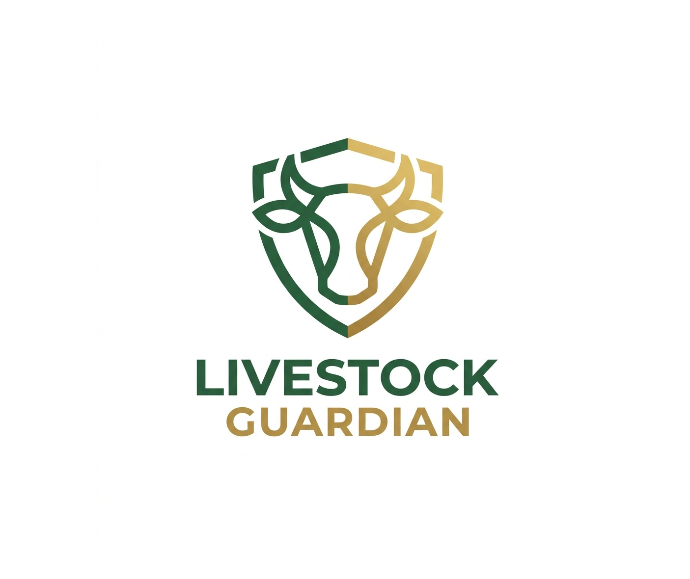

# Livestock Guardian

AI-Powered Livestock Identification & Theft Prevention System

A smart Android application that uses biometric muzzle recognition, artificial intelligence, and cloud technologies to uniquely identify livestock, verify ownership, and reduce animal theft.

## Problem Statement

Livestock theft and ownership disputes are major challenges in the agriculture sector. 
Traditional identification methods such as ear tags, branding, and paper records can be forged, removed, or lost.
Livestock Guardian solves this problem using biometric muzzle recognition, creating a unique digital identity for every animal.

## Solution

The application enables farmers to:

- Register livestock
- Capture muzzle biometric data
- Identify animals using AI
- Verify ownership
- Report stolen animals
- Maintain ownership history
